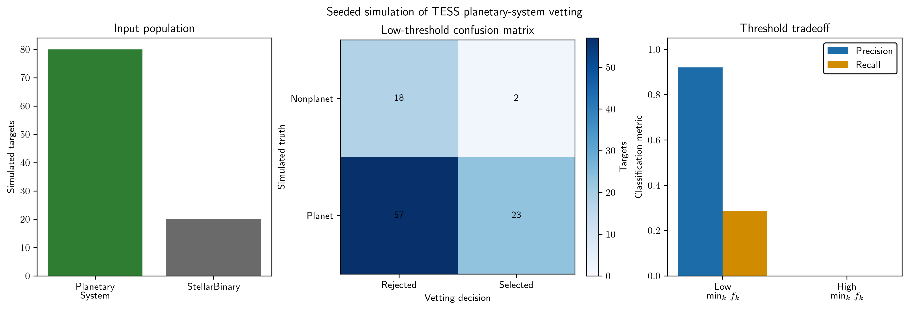

# sardis

## Scientific purpose
Sardis is a workflow for exoplanet candidate vetting and occurrence-style evaluation based on time-domain photometric data and related model diagnostics. It acts as a pipeline layer around shared time-domain and modeling functionality rather than as a monolithic analysis script.

## Repository role in the ecosystem
Sardis is a workflow-focused package that uses the shared time-domain infrastructure in the broader ecosystem, especially the path conventions and plotting utilities provided by the active scientific stack. It is designed to keep project-specific candidate-vetting logic separate from the lower-level numerical and plotting library layers.

## Installation

```bash
cd /path/to/sardis
pip install -e .
export SARDIS_PATH=/path/to/sardis
```

`SARDIS_PATH` identifies the repository root. Keep runtime inputs in `data/` and generated pipeline outputs in `visuals/`; both directories are ignored by Git. Existing workflow data-root configuration remains unchanged.

## Minimal usage

The runnable example passes Troia's seeded synthetic population through Sardis and summarizes the returned truth labels and vetting decisions:

```bash
python examples/synthetic_vetting_performance.py --typefileplot png
```



The figure shows the simulated input population, the low-threshold confusion matrix, and the precision-recall tradeoff for both returned classifier decisions. The targets and labels are generated by the pipeline under its fixed synthetic-population seed. They are simulated data rather than observed TESS candidates.

## Outputs and diagnostics
The package writes its processed data products and visualization outputs under a normalized project path tree rooted in the configured data directory. This keeps the candidate-vetting workflow inspectable and reproducible without hard-coded machine-specific paths.

## Current maintenance status
The repository is active as a workflow package but remains narrower in scope than the shared numerical and plotting libraries. The supported entry points are the package import surface and the `init()` workflow; legacy exploratory scripts should not be treated as the active API.

