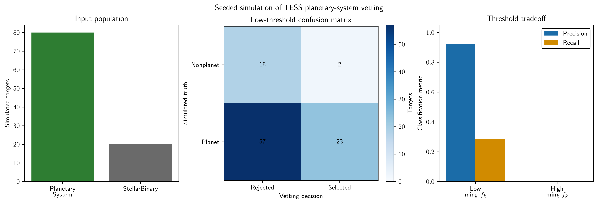

# sardis

## Purpose
Sardis is a workflow for exoplanet candidate vetting and occurrence-style evaluation based on time-domain photometric data and model diagnostics.

## Candidate-vetting analysis
Sardis applies candidate-vetting decisions to target populations, compares those decisions with known or simulated labels, calculates confusion matrices, and evaluates precision-recall tradeoffs across decision thresholds.

## Installation

```bash
cd /path/to/sardis
pip install -e .
export SARDIS_PATH=/path/to/sardis
```

`SARDIS_PATH` identifies the repository root. Keep runtime inputs in `data/` and generated pipeline outputs in `visuals/`; both directories are ignored by Git. Existing workflow data-root configuration remains unchanged.

## Minimal usage

The runnable example passes Troia's seeded synthetic population through Sardis and summarizes the returned truth labels and vetting decisions:

```bash
python examples/synthetic_vetting_performance.py --typefileplot png
```



The figure shows the simulated input population, the low-threshold confusion matrix, and the precision-recall tradeoff for both returned classifier decisions. The targets and labels are generated by the pipeline under its fixed synthetic-population seed. They are simulated data rather than observed TESS candidates.

## Outputs and diagnostics
The package writes its processed data products and visualization outputs under a normalized project path tree rooted in the configured data directory. This keeps the candidate-vetting workflow inspectable and reproducible without hard-coded machine-specific paths.

